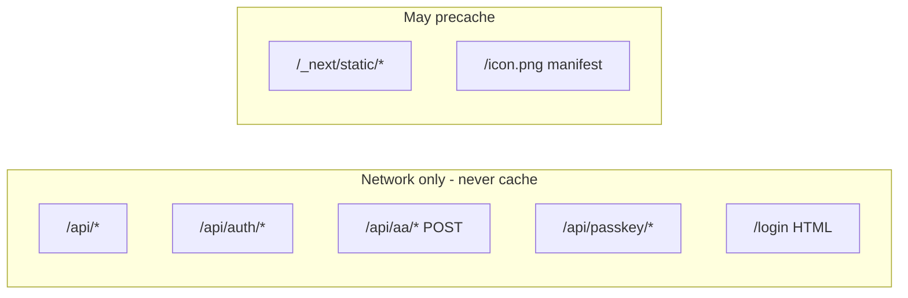
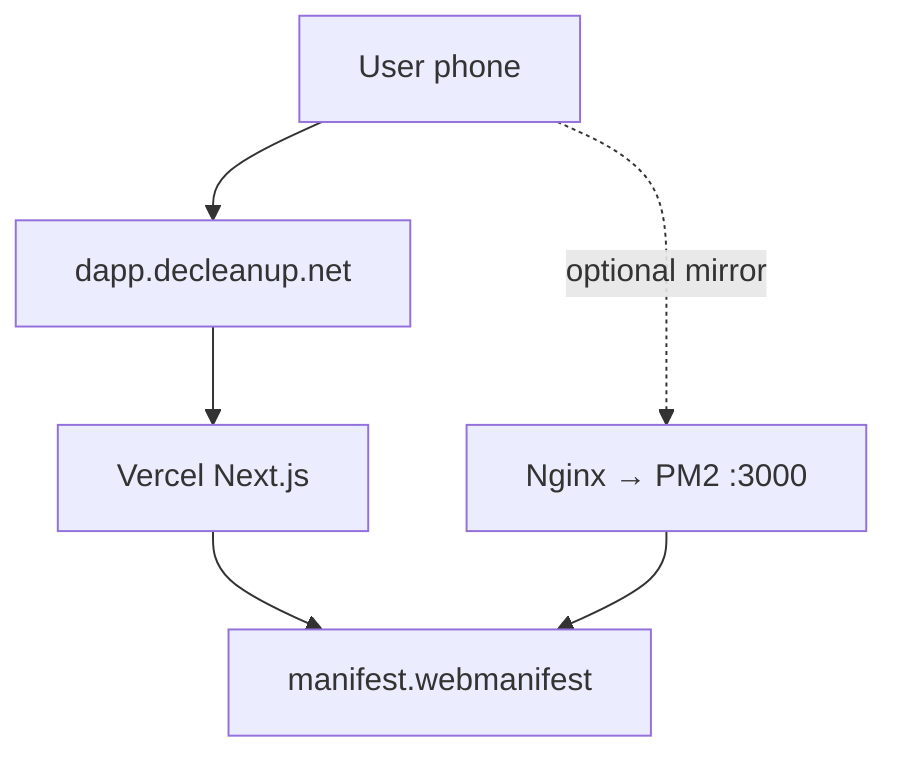

# PWA preparation plan (DeCleanup Rewards)

**Status:** Phase 1 shipped in code (manifest + meta). **Phase 2+** not implemented (service worker, install UI).

**Canonical install origin:** `https://dapp.decleanup.net` only.

This document is **local planning** — not required for production deploy. See `docs/SEO_GOOGLE_SEARCH.md` for Google indexing.

---

## 1. What “PWA” means for this app

A Progressive Web App here means:

1. **Installable** — user can “Add to Home Screen” / “Install app”.
2. **Standalone shell** — opens without browser URL bar (`display: standalone`).
3. **Optional offline** — only if we add a service worker (not done yet).

DeCleanup Rewards is **auth-heavy** and **wallet-heavy**. A bad service worker is worse than no PWA. Phase 1 optimizes **installability without caching API traffic**.

---

## 2. Phase 1 (done in repo)

| Asset | Path | Notes |
|-------|------|--------|
| Web manifest | `frontend/public/manifest.webmanifest` | name, icons, theme, `start_url: /` |
| Manifest link | Root `metadata.manifest` | Next.js emits `<link rel="manifest">` |
| Apple web app | `metadata.appleWebApp` | iOS home screen title + status bar |
| Theme color | `viewport.themeColor` + manifest | `#58b12f` |
| Icons | `/icon.png`, `/apple-icon.png` | Must exist under `frontend/public/` on deploy |
| MIME header | `next.config.mjs` | `application/manifest+json` |

### 2.1 Manual test (no service worker)

**Android Chrome**

1. Open `https://dapp.decleanup.net`
2. Menu → **Install app** or **Add to Home screen**
3. Launch from launcher → should open fullscreen-ish with green theme

**iOS Safari**

1. Share → **Add to Home Screen**
2. Note: no `beforeinstallprompt`; no full PWA install banner API
3. Passkeys and WalletConnect: test sign-in and external wallet after install

**Desktop Chrome**

1. Address bar install icon (if manifest valid + SW not required on some builds)

---

## 3. Phase 2 — Service worker (planned)

### 3.1 Recommended library

| Option | Fit |
|--------|-----|
| **Serwist** (`@serwist/next`) | App Router, maintained, granular routing |
| **@ducanh2912/next-pwa** | Wrapper around Workbox for Next |

Pick one; do not hand-roll fetch interception.

### 3.2 Cache policy (non-negotiable)



| Request pattern | Strategy |
|-----------------|----------|
| `GET /api/*` | **Network only** |
| `POST /api/*` | **Network only** (SW should not intercept) |
| `GET /login`, OAuth callbacks | **Network only** |
| `GET /_next/static/*` | CacheFirst or StaleWhileRevalidate with revision hash |
| `GET /` HTML | **Network first** (avoid stale dashboard shell) |
| WebSocket `wss://*.walletconnect.*` | **Do not intercept** |

### 3.3 CSP update

When SW is added, extend `frontend/csp-headers.mjs`:

```
worker-src 'self';
```

Redeploy and test WalletConnect modal + Google OAuth popup.

### 3.4 Deploy hygiene

- Bump **SW revision** every production release.
- Document “hard refresh” for support if users see stale UI.
- Consider `skipWaiting` + client prompt “Update available” for controlled updates.

---

## 4. Phase 3 — Install UX (planned)

1. Listen for `beforeinstallprompt` (Chromium).
2. Show dismissible banner on home or guide: “Install DeCleanup Rewards”.
3. Store dismissal in `localStorage` for 30 days.
4. iOS: show instruction sheet (“Share → Add to Home Screen”) — no native prompt API.

---

## 4.1 Icons and splash (gaps)

| Asset | Size | Purpose |
|-------|------|---------|
| `icon-192.png` | 192×192 | Android launcher |
| `icon-512.png` | 512×512 | Splash / high-DPI |
| Maskable safe zone | 512 with padding | Android adaptive icon |
| `apple-touch-startup-image` | multiple | iOS launch screen (optional) |

Update `manifest.webmanifest` `icons` array when files exist.

---

## 5. VPS vs Vercel — does PWA interfere?

**Short answer: No**, if both serve the same build and canonical URL.

| Topic | Vercel | VPS (`207.180.203.243`) |
|-------|--------|-------------------------|
| Who serves manifest? | Next static | Same via PM2 → Nginx proxy |
| Separate PWA server? | No | No |
| Conflict with PM2? | N/A | None |
| ML / GPU routes | N/A | Unaffected (different paths) |
| `UPLOAD_DIR` on disk | Vercel blob vs VPS disk | PWA unrelated |

**Rules:**

1. **One canonical origin** for installs: `https://dapp.decleanup.net`.
2. Do not encourage users to install from raw IP — separate origin = separate app + separate WebAuthn RP scope.
3. Keep `NEXT_PUBLIC_SITE_URL` aligned on VPS if you mirror the app (see `docs/VPS_DEPLOYMENT.md`).
4. Nginx must pass through `manifest.webmanifest` and future `sw.js` with correct MIME types (Next config already sets manifest type).



---

## 6. Auth methods vs installed PWA

Installed PWA = **same origin** as browser tab. Cookies and `localStorage` scope to `dapp.decleanup.net`.

| Method | Breaks in PWA? | Requirements |
|--------|----------------|--------------|
| **Email magic link (Auth.js + Resend)** | No | `AUTH_URL` / callback on same host; link opens in installed app or browser; SW must not cache `/api/auth/*` |
| **Google OAuth** | Usually no | `COOP: same-origin-allow-popups` already in `next.config.mjs`; test iOS standalone |
| **Embedded smart account (Pimlico)** | No | POST `/api/aa/*` network-only |
| **Passkeys (WebAuthn)** | No if RP ID matches | `NEXT_PUBLIC_WEBAUTHN_RP_ID=dapp.decleanup.net` (or derived from APP_URL) |
| **External wallet (WalletConnect / RainbowKit)** | No | User may leave to wallet app; deep link return; SW must not break `wss://` relay |
| **Import wallet / recovery** | No | Keep network-only for sensitive routes |

### 6.1 WebAuthn detail

RP ID is **hostname only** (`dapp.decleanup.net`), not path. Installed PWA on that host shares credentials with Safari/Chrome on same host.

**Do not** change production hostname without:

1. Updating `NEXT_PUBLIC_WEBAUTHN_RP_ID`
2. Expecting users to re-register passkeys

### 6.2 Magic link detail

Magic links often open the **system browser** on mobile, then redirect back. Ensure:

- Redirect URI allowlist includes production URL
- No SW serving stale `/login` page

### 6.3 WalletConnect detail

WC uses:

- In-page modal (RainbowKit)
- iframe verify (`verify.walletconnect.org`) — allowed in CSP
- WebSocket relay — must not be cached or offline-blocked

External wallets (MetaMask app): OS handles app switch; PWA does not replace deep linking.

---

## 7. Failure modes to avoid

| Mistake | Symptom |
|---------|---------|
| Cache `GET /api/auth/session` | Logged out or logged in wrong user |
| Offline-first HTML for `/` | Stale landing or broken wallet state |
| SW on preview deployments | Dev cookies confused with prod |
| Install from VPS IP | Second app icon; passkeys don’t match prod |
| `worker-src` missing after SW | SW fails to register; silent install failure |

---

## 8. Implementation checklist (when you start Phase 2)

- [ ] Add 512px + maskable icons to `public/`
- [ ] Integrate Serwist (or next-pwa) with explicit denylist for `/api`
- [ ] Add `worker-src` to CSP
- [ ] Test matrix: Android install, iOS A2HS, email login, Google login, passkey, WC external wallet
- [ ] Test on VPS mirror only if VPS is public — still use domain in tests
- [ ] Add “Update available” toast on SW update
- [ ] Document support steps in user guide (optional)

---

## 9. What we deliberately skip (unless product asks)

- Push notifications
- Background sync for submissions
- Offline cleanup submit (needs queue + conflict resolution)
- Farcaster mini-app duplicate install path

---

## 10. Related files

```
frontend/public/manifest.webmanifest
frontend/src/app/layout.tsx          # manifest + appleWebApp metadata
frontend/next.config.mjs             # manifest headers
frontend/csp-headers.mjs             # update when SW added
frontend/src/lib/passkey/config.ts   # WebAuthn RP ID
frontend/src/lib/auth/config.ts      # Auth.js providers
docs/VPS_DEPLOYMENT.md
```
