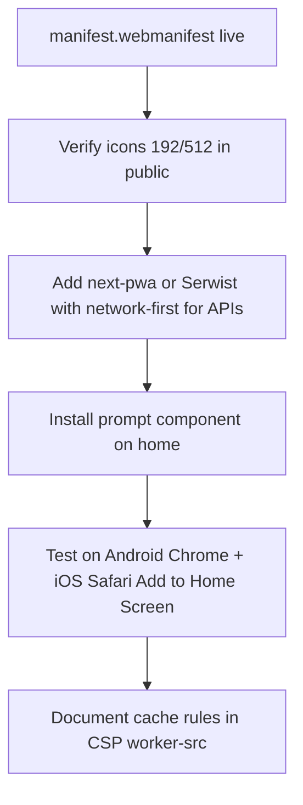

# SEO and PWA preparation (DeCleanup Rewards)

This doc covers **Google discoverability** for `https://dapp.decleanup.net`, what is **implemented in the repo**, what you must do **outside the repo** (Search Console), and how a future **PWA** relates to **Vercel**, the **VPS**, **auth**, and **WalletConnect**.

---

## Part 1 — Making “DeCleanup Rewards” findable on Google

### What Google needs

| Requirement | Status in repo |
|-------------|----------------|
| Stable canonical URL (`dapp.decleanup.net`, not raw IP) | Set `NEXT_PUBLIC_WEB_APP_URL` / `NEXT_PUBLIC_SITE_URL` in Vercel and VPS |
| Unique `<title>` and meta description per page | `frontend/src/lib/seo/metadata.ts` + route layouts |
| `metadataBase` + canonical links | Root `layout.tsx` via `rootSiteMetadata()` |
| `robots.txt` | `frontend/src/app/robots.ts` |
| `sitemap.xml` | `frontend/src/app/sitemap.ts` |
| JSON-LD (`WebSite`, `Organization`, `WebApplication`) | `frontend/src/components/seo/SiteJsonLd.tsx` |
| Public pages indexable; auth/wallet pages not | `robots.ts` disallow + `noIndex` layouts |
| Fast HTTPS, no accidental `noindex` on home | Vercel / Nginx TLS (see `docs/VPS_DEPLOYMENT.md`) |

Indexing is **not automatic**. After deploy you must verify the property in **Google Search Console** and submit the sitemap.

### Implemented routes in sitemap

- `/` (home)
- `/guide`
- `/leaderboard`
- `/hypercerts`
- `/airdrop`
- `/staking`
- `/terms`
- `/privacy`

**Excluded** (by design): `/login`, `/wallet`, `/dashboard`, `/profile`, `/cleanup`, `/api/*`, `/admin/*`, etc.

**Impact portfolios** (`/impact/[address]`) are public and shareable but not listed in the static sitemap (too many URLs). They are still crawlable if linked from the landing feed or external sites. A future enhancement is a dynamic sitemap from the impact API.

### Your checklist (after deploy)

1. **Confirm env on production** (Vercel Production):
   - `NEXT_PUBLIC_WEB_APP_URL=https://dapp.decleanup.net`
   - `NEXT_PUBLIC_SITE_URL=https://dapp.decleanup.net`
2. **Redeploy** so `robots.txt` and `sitemap.xml` are live.
3. Open [Google Search Console](https://search.google.com/search-console):
   - Add property **URL prefix**: `https://dapp.decleanup.net`
   - Verify via **HTML tag**: copy the `content` value from Google into Vercel env:
     - `GOOGLE_SITE_VERIFICATION=<token>`
   - Redeploy once more (metadata emits the tag).
4. **Sitemaps** → submit: `https://dapp.decleanup.net/sitemap.xml`
5. **URL inspection** → request indexing for `/` and `/guide`.
6. Optional: [Rich Results Test](https://search.google.com/test/rich-results) on the homepage.
7. **Do not** point Search Console at the VPS IP (`207.180.203.243`) unless that host is the canonical public URL. Production brand URL is Vercel today.

### Timeline expectations

- Verification: minutes after deploy.
- First crawl/index: often **days to a few weeks** for a new or low-link domain.
- Ranking for the exact query “DeCleanup Rewards” improves with brand mentions, backlinks, and consistent use of the name in titles (already in default title).

### Home page and client rendering

The landing page is a **client component**, but the root layout still ships **server metadata** (title, description, OG, JSON-LD). The visible hero already includes **DECLEANUP REWARDS** in the H1, which helps relevance.

---

## Part 2 — PWA flow: current state, gaps, and compatibility

### Current state (installed web app lite)

Already present:

| Piece | Location |
|-------|----------|
| Web app manifest | `frontend/public/manifest.webmanifest` |
| Manifest link | Root metadata `manifest: '/manifest.webmanifest'` |
| `appleWebApp` meta | Root metadata |
| Theme color | `viewport.themeColor` + manifest `theme_color` |
| Icons referenced | `/icon.png`, `/apple-icon.png` (must exist in `public/` on deploy) |

**Not present yet** (full PWA):

| Missing piece | Why it matters |
|---------------|----------------|
| Service worker | Offline shell, precache, “Add to Home Screen” prompts on Android Chrome |
| Install UI | Custom `beforeinstallprompt` banner |
| Maskable icons (192, 512) | Better Android launcher icon |
| iOS splash / `apple-touch-startup-image` | Polished launch on iPhone |
| `display_override` / shortcuts | Optional UX |
| Push notifications | Out of scope unless product asks |
| SW cache policy for `/api/*` | **Critical** — wrong caching breaks auth |

### Recommended PWA implementation order



1. Ensure **`public/icon.png`** and **`public/apple-icon.png`** (and 512px icon) are committed or copied in deploy pipeline.
2. Add a service worker via **Serwist** or **`@ducanh2912/next-pwa`** (Next 14+ App Router compatible).
3. **Cache strategy**:
   - **Network-only**: `/api/*`, `/login`, auth callbacks, WalletConnect relay traffic (browser handles WC, not SW).
   - **Stale-while-revalidate**: static JS/CSS from `/_next/static/*`.
   - **Do not** cache HTML for authenticated routes.
4. Add a small **“Install app”** entry in the user guide or footer after `beforeinstallprompt` fires.
5. Extend CSP in `frontend/csp-headers.mjs` with `worker-src 'self'` when a SW is added.

### Does PWA interfere with the VPS flow?

**No conflict** if both hosts serve the **same Next.js build** with the same env.

| Host | Role today |
|------|------------|
| **Vercel** | Canonical public URL `dapp.decleanup.net` |
| **VPS** | Optional mirror: PM2 + Nginx, ML, uploads (`docs/VPS_DEPLOYMENT.md`) |

PWA assets (`manifest.webmanifest`, future `sw.js`) are static files from the Next build. On VPS, Nginx proxies to `127.0.0.1:3000` like any other route. No separate PWA server.

**Caveats:**

- Install the PWA from **one origin only** (e.g. `https://dapp.decleanup.net`). Installing from `http://207.180.203.243:3000` creates a separate, non-brand app slot.
- Keep **`NEXT_PUBLIC_SITE_URL`** identical on Vercel and VPS when you mirror production.
- After adding a service worker, **bump cache version** on each production deploy so users do not run stale API clients.

### Does PWA break auth or WalletConnect?

**It should not**, if implemented with standard rules:

| Feature | PWA interaction |
|---------|-----------------|
| **Email magic link (Auth.js / Resend)** | Opens in browser or installed app on **same origin**; callback URL must stay `https://dapp.decleanup.net`. No change if SW does not intercept navigation to `/api/auth/*`. |
| **Google OAuth** | Popup / redirect flow; already uses `Cross-Origin-Opener-Policy: same-origin-allow-popups` in `next.config.mjs`. PWA standalone mode still supports this on Chromium; test Safari iOS. |
| **Embedded wallet / AA (Pimlico, smart account)** | Same APIs over HTTPS; SW must **not** cache POST `/api/aa/*` or `/api/passkey/*`. |
| **Passkeys (WebAuthn)** | **RP ID = hostname** (`dapp.decleanup.net`). Installed PWA is still that origin. Do not change hostname without updating `NEXT_PUBLIC_WEBAUTHN_RP_ID`. |
| **External wallet / WalletConnect** | Runs in page context; relay is `wss://`. Service worker should not intercept WebSocket or wallet deep links. RainbowKit modals work in standalone display mode. |
| **WalletConnect verify iframe** | Already allowed in CSP `frame-src`; unchanged. |

**Failure mode to avoid:** a service worker that caches `GET /api/*` responses or serves offline HTML for `/login`. That can show stale session state or break OAuth redirects. Use **network-first** or **bypass** for all `/api/`.

### Auth methods summary

| Method | Safe with PWA? | Notes |
|--------|----------------|-------|
| Email magic link | Yes | Same `AUTH_URL` / `NEXTAUTH_URL` as production URL |
| Google sign-in | Yes | Test in installed iOS app |
| Passkey | Yes | Hostname must match RP ID |
| External wallet (WC) | Yes | User may switch to wallet app and back |
| Import / recovery flows | Yes | Keep those routes `noindex`, network-only |

---

## Part 3 — File map (developers)

| File | Purpose |
|------|---------|
| `frontend/src/lib/site.ts` | Canonical URL, brand strings, OG image |
| `frontend/src/lib/seo/metadata.ts` | `buildPageMetadata`, `rootSiteMetadata` |
| `frontend/src/app/robots.ts` | Crawl rules |
| `frontend/src/app/sitemap.ts` | Public URL list |
| `frontend/src/components/seo/SiteJsonLd.tsx` | Structured data |
| `frontend/public/manifest.webmanifest` | PWA manifest (phase 1) |
| `frontend/ENV_TEMPLATE.md` | `GOOGLE_SITE_VERIFICATION` |

---

## Part 4 — Quick verification commands

After deploy:

```bash
curl -sS https://dapp.decleanup.net/robots.txt
curl -sS https://dapp.decleanup.net/sitemap.xml
curl -sS -o /dev/null -w "%{http_code}\n" https://dapp.decleanup.net/manifest.webmanifest
```

Expect `200` for all three.

---

## Related docs

- `docs/VPS_DEPLOYMENT.md` — VPS mirror and env
- `docs/deployment-plan.md` — release checklist
- `frontend/ENV_TEMPLATE.md` — production env block
- `docs/AUTH_EMAIL_TROUBLESHOOTING.md` — magic link issues (orthogonal to PWA)
