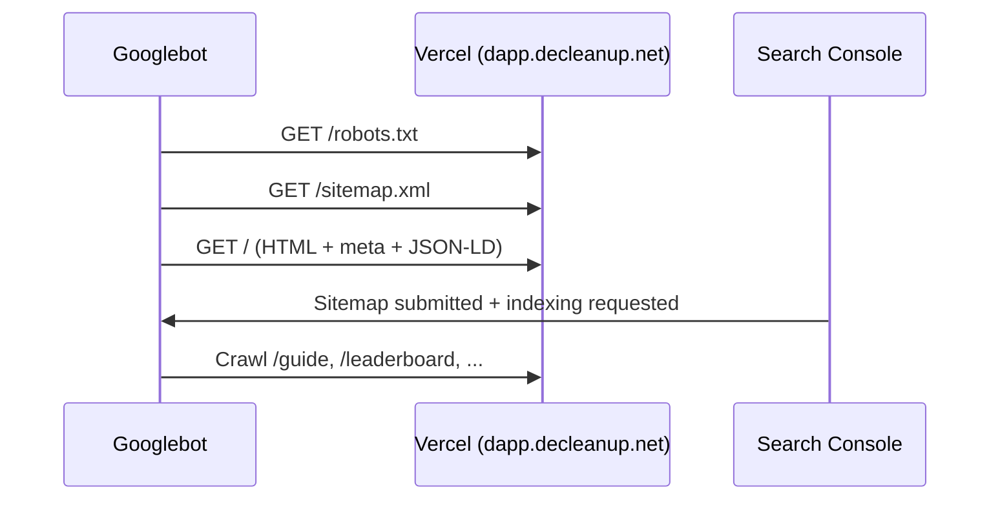

# Google Search for DeCleanup Rewards (detailed runbook)

**Canonical URL:** `https://dapp.decleanup.net`  
**Product name to rank for:** DeCleanup Rewards (also: DeCleanup, cleanup rewards Celo)

This document is the **operator runbook** for search visibility. Implementation lives in the frontend; this file is kept **local** until you choose to publish it.

---

## 1. How Google discovers the dapp



Google does **not** use your wallet APIs to understand the product. It uses:

1. **HTTPS HTML** returned on first response (status 200).
2. **`<title>`**, **meta description**, **`link rel=canonical`**, **Open Graph** (secondary for search, primary for social).
3. **`robots.txt`** (allow/disallow) and **`sitemap.xml`** (hint list of URLs).
4. **JSON-LD** in the page (`WebSite`, `Organization`, `WebApplication`) for entity understanding.
5. **Links** from other sites (Giveth, docs, Twitter, partners).
6. **Search Console** signals (sitemap, manual indexing, no critical coverage errors).

The home route is a **client component**, but Next.js still renders **server metadata** from `frontend/src/app/layout.tsx` via `rootSiteMetadata()`. Crawlers receive full tags without executing React.

---

## 2. What we implemented in code

### 2.1 Central config

| File | Role |
|------|------|
| `frontend/src/lib/site.ts` | `getSiteUrl()`, brand title/description, keywords, default OG image URL |
| `frontend/src/lib/seo/metadata.ts` | `rootSiteMetadata()`, `buildPageMetadata()`, `metadataBase`, OG/Twitter helpers |

**Canonical origin** resolves in order:

1. `NEXT_PUBLIC_WEB_APP_URL`
2. `NEXT_PUBLIC_SITE_URL`
3. `NEXT_PUBLIC_APP_URL`
4. Fallback `https://dapp.decleanup.net`

All canonicals and sitemap URLs must use the **same** host in production. Mixed hosts (Vercel preview vs production) split SEO equity.

### 2.2 Root metadata (every page inherits)

- **Title template:** `%s | DeCleanup Rewards`
- **Default title:** `DeCleanup Rewards | Verified environmental cleanups on Celo`
- **Description:** mentions DeCleanup Rewards, cleanups, DCU, $cDCU, Celo
- **Keywords array:** brand + category terms
- **`metadataBase`:** required for relative OG URLs in App Router
- **`manifest`:** `/manifest.webmanifest` (installability; see PWA doc)
- **`GOOGLE_SITE_VERIFICATION`:** when set, emits Google HTML tag verification

### 2.3 `robots.txt` (`frontend/src/app/robots.ts`)

| Rule | Paths |
|------|--------|
| **Allow** | `/` (entire site except disallows) |
| **Disallow** | `/api/`, `/admin/`, `/dashboard`, `/wallet`, `/profile`, `/cleanup`, `/login`, `/import-wallet`, `/recovery`, `/create-hypercert`, `/verifier` |
| **Sitemap** | `{SITE_URL}/sitemap.xml` |
| **Host** | `{SITE_URL}` |

**Why disallow wallet/login:** avoid indexing duplicate thin pages, session-specific UI, and API noise. Marketing pages stay indexable.

### 2.4 `sitemap.xml` (`frontend/src/app/sitemap.ts`)

| URL | priority | changeFrequency |
|-----|----------|-----------------|
| `/` | 1.0 | weekly |
| `/guide` | 0.9 | monthly |
| `/leaderboard` | 0.85 | daily |
| `/hypercerts` | 0.8 | weekly |
| `/airdrop` | 0.75 | weekly |
| `/staking` | 0.5 | monthly |
| `/terms` | 0.4 | yearly |
| `/privacy` | 0.4 | yearly |

**Not in sitemap (by design):**

- `/impact/[address]` — unbounded dynamic URLs; still indexable when linked from landing feed or external backlinks. Future: `sitemap.ts` that calls impact API for top N addresses.
- `/share` — redirect/OG helper; low SEO value.
- Auth-gated routes — excluded via robots + `noIndex` metadata.

### 2.5 Per-route metadata

Server `layout.tsx` files attach `buildPageMetadata()` for client-only pages (`leaderboard`, `hypercerts`, `airdrop`, etc.).

**`noIndex: true`** on: `/login`, `/wallet`, `/dashboard`, `/profile`, `/cleanup` (matches robots disallow).

**Server pages** (`guide`, `terms`, `privacy`) export metadata directly.

**Impact portfolios** (`frontend/src/app/impact/[address]/layout.tsx`): dynamic title `Impact Portfolio · 0xabc…def`, indexable, OG for sharing.

### 2.6 Structured data (`SiteJsonLd`)

Injected once in root layout:

- `WebSite` → name, url, description
- `Organization` → DeCleanup Network, `https://decleanup.net`
- `WebApplication` → free offer, lifestyle category

Validate after deploy: [Rich Results Test](https://search.google.com/test/rich-results).

### 2.7 Typography and on-page relevance (recent)

- Visible H1: **DECLEANUP REWARDS** on home and program heroes.
- Fonts: Space Grotesk + Inter only (no extra webfonts hurting LCP).
- Animated `.gradient-text` on “DECLEANUP” (cosmetic; does not block crawlers).

---

## 3. Environment variables (production)

Set on **Vercel Production** (and VPS if it mirrors public URL):

```bash
NEXT_PUBLIC_WEB_APP_URL=https://dapp.decleanup.net
NEXT_PUBLIC_SITE_URL=https://dapp.decleanup.net
NEXT_PUBLIC_APP_URL=https://dapp.decleanup.net

# After Search Console HTML tag verification:
GOOGLE_SITE_VERIFICATION=xxxxxxxxxxxxxxxxxxxxxxxxxxxxxxxxxxxxxxx
```

Also ensure Auth.js URLs match the same origin (see `frontend/ENV_TEMPLATE.md`):

- `AUTH_URL` / `NEXTAUTH_URL` → `https://dapp.decleanup.net`

**Do not** register `http://207.180.203.243:3000` in Search Console unless that IP becomes the canonical marketing domain.

---

## 4. Step-by-step: Search Console setup

### 4.1 Add property

1. Go to [Google Search Console](https://search.google.com/search-console).
2. **Add property** → **URL prefix** → `https://dapp.decleanup.net`
3. Verification method: **HTML tag**
4. Copy the `content="..."` value (not the full meta tag).

### 4.2 Wire verification into Vercel

1. Vercel → Project → Settings → Environment Variables.
2. Add `GOOGLE_SITE_VERIFICATION` = pasted token (Production only).
3. **Redeploy** production.
4. View source on `https://dapp.decleanup.net` and confirm:
   ```html
   <meta name="google-site-verification" content="YOUR_TOKEN" />
   ```
5. Click **Verify** in Search Console.

### 4.3 Submit sitemap

1. Search Console → **Sitemaps**.
2. Enter: `sitemap.xml` (relative) or full URL `https://dapp.decleanup.net/sitemap.xml`.
3. Status should move to **Success** after next crawl.

### 4.4 Request indexing (important pages)

1. **URL inspection** → enter `https://dapp.decleanup.net/`
2. **Test live URL** → confirm Google sees 200 and correct title.
3. **Request indexing** (repeat for `/guide` if needed).

### 4.5 Monitor (first 30 days)

| Report | What to watch |
|--------|----------------|
| **Pages** | Indexed vs not indexed; fix “Excluded by noindex” mistakes |
| **Sitemaps** | Discovered URLs ≈ 8 |
| **Core Web Vitals** | LCP on mobile (landing is heavy; improve if “Poor”) |
| **Manual actions** | Should be none |

---

## 5. Post-deploy verification (curl)

```bash
BASE=https://dapp.decleanup.net

curl -sS "$BASE/robots.txt" | head -20
curl -sS "$BASE/sitemap.xml" | head -40
curl -sS "$BASE" | grep -E '<title>|canonical|application/ld\+json|DeCleanup Rewards' | head -10
curl -sS -o /dev/null -w "manifest HTTP %{http_code}\n" "$BASE/manifest.webmanifest"
```

Expected:

- `robots.txt` lists `Sitemap: https://dapp.decleanup.net/sitemap.xml`
- `sitemap.xml` contains 8 `<url>` entries
- Home `<title>` contains **DeCleanup Rewards**
- JSON-LD script present

---

## 6. Growing rankings (beyond code)

Code enables **indexing**; **ranking** for “DeCleanup Rewards” needs distribution:

| Action | Why it helps |
|--------|----------------|
| Link from [decleanup.net](https://decleanup.net) to dapp | Strong brand association |
| Giveth / partner pages link to dapp | Trust + crawl paths |
| Consistent name in social bios | Branded search volume |
| Google Business Profile (if applicable) | Local/nonprofit discovery |
| Press / blog posts with exact product name | Anchor text |

Avoid:

- Duplicate live sites on IP and domain with same content (pick one canonical).
- Blocking Googlebot in Nginx (VPS hardening must still allow `Googlebot` user-agent if VPS is public).

---

## 7. Troubleshooting

| Symptom | Likely cause | Fix |
|---------|--------------|-----|
| Sitemap “Couldn’t fetch” | Wrong domain or 401 on Vercel | Ensure property URL matches deploy; no basic auth on prod |
| Home not indexed | New site, no links | Request indexing; wait; add backlinks |
| Wrong title in results | Old cache | Search Console → inspect URL → see Google-selected title |
| `noindex` on home | Accidental metadata | Check `rootSiteMetadata()` robots.index |
| VPS IP indexed instead of domain | `NEXT_PUBLIC_SITE_URL` pointed at IP on VPS | Set to `https://dapp.decleanup.net` |
| Verification fails | Token not deployed | Redeploy after env change |

---

## 8. File reference (developers)

```
frontend/src/lib/site.ts
frontend/src/lib/seo/metadata.ts
frontend/src/app/robots.ts
frontend/src/app/sitemap.ts
frontend/src/components/seo/SiteJsonLd.tsx
frontend/src/app/layout.tsx
frontend/src/app/*/layout.tsx   # per-route metadata
frontend/public/manifest.webmanifest
frontend/next.config.mjs        # manifest Content-Type header
```

---

## 9. Related

- PWA install and auth compatibility: `docs/PWA_PREP_PLAN.md` (local)
- VPS mirror: `docs/VPS_DEPLOYMENT.md`
- Deploy checklist: `docs/deployment-plan.md`
